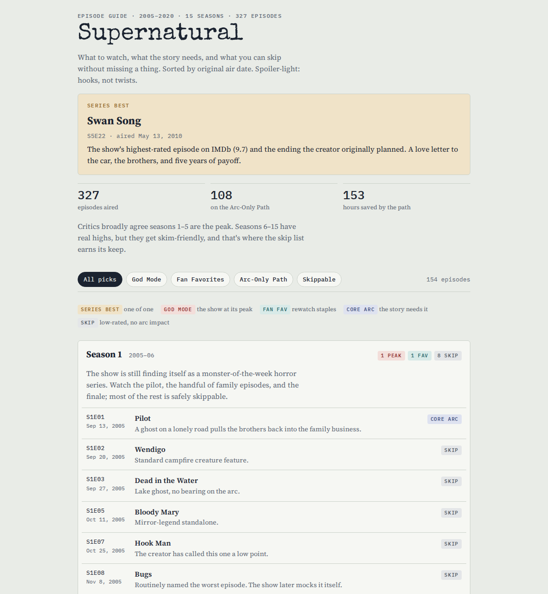

# agent-skills

**Drop-in skills that make Claude and ChatGPT do one job well, the same way every time.**


<sub>Real output from the <code>episode-guide</code> skill. See more in <a href="https://github.com/bwfnx/watch-guides">watch-guides</a>.</sub>

## Install

**Claude Code:** copy a skill folder into your skills directory.

```bash
git clone https://github.com/bwfnx/agent-skills
cp -r agent-skills/skills/episode-guide ~/.claude/skills/
```

**Claude app or ChatGPT:** zip the skill's folder (for example `skills/episode-guide/`) and upload it wherever your app accepts skills.

Then just ask for the job, like "best episodes of Supernatural, and what can I skip?"

## Skills

| Skill | What it does | Status |
|---|---|---|
| [`episode-guide`](skills/episode-guide/) | Season-by-season guide to the best, essential, and skippable episodes of any show or film series, with an optional kid-safe path by age | Active · v1.5 |
| [`transcript-to-action-plan-email`](skills/transcript-to-action-plan-email/) | Turns an SBDC client meeting transcript into a Neoserra-ready follow-up email and action plan | Active · v1.0 |
| [`competitive-research-analyst`](skills/competitive-research-analyst/) | Current, web-researched competitor, pricing, and market analysis for small businesses | Draft · v1.0 |

Full inventory: [`SKILLS_INDEX.md`](SKILLS_INDEX.md) · machine-readable: [`skills/manifest.json`](skills/manifest.json)

## How skills are built

Each skill lives in `skills/<skill-slug>/` with a `SKILL.md` (the instructions), `agents/openai.yaml` (ChatGPT settings), a `README.md`, and a `CHANGELOG.md`. Every version is tested on real inputs before release; release notes are in [`releases/`](releases/).

Maintainer docs: [repo conventions](docs/REPO_CONVENTIONS.md) · [release workflow](docs/RELEASE_WORKFLOW.md) · [new-skill checklist](templates/SKILL_CHECKLIST.md)
